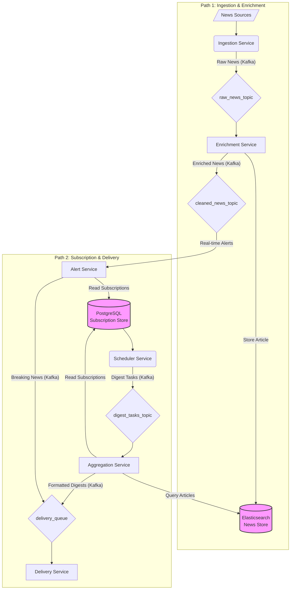

# MyNews - System Design

This document outlines the architecture for the **MyNews Personalized News Aggregation and Delivery System**.

## 1. Core Goal & System Principles

The system's primary goal is to deliver personalized news digests to users based on their subscriptions. It is designed with two highly decoupled, parallel paths to ensure scalability and resilience:

- **Path 1: Ingestion & Enrichment (The "Write Path")**: Continuously ingests, cleans, categorizes, and stores news articles. This path is optimized for high-throughput data processing.
- **Path 2: Subscription & Delivery (The "Read Path")**: Delivers personalized news digests to users based on their subscriptions. This path is optimized for reliable, scheduled, and real-time delivery.

## 2. High-Level Architecture

The following diagram illustrates the high-level architecture of the MyNews system.

## 3. Key Technologies

| Component          | Technology      | Role in System                                           | Rationale                                                    |
| ------------------ | --------------- | -------------------------------------------------------- | ------------------------------------------------------------ |
| **Message Broker** | Kafka Cluster   | Asynchronous communication between services.             | Handles high-volume data streams and decouples services.     |
| **Subscription Store** | PostgreSQL      | Stores user profiles and subscription preferences.       | Ensures strong consistency (ACID) for critical user data.    |
| **News Store**     | Elasticsearch   | Stores enriched and indexed news articles.               | Optimized for fast, complex full-text search and aggregation. |

## 4. Data Models

### Subscription (PostgreSQL)

- `user_id`: Unique identifier for the user.
- `selected_topics`: List of topics the user is interested in.
- `selected_sources`: List of news sources the user follows.
- `delivery_schedule`: Cron expression for digest delivery.
- `breaking_news_enabled`: Boolean flag for real-time alerts.

### NewsArticle (Elasticsearch)

- `article_id`: Unique identifier for the article.
- `title`: The headline of the article.
- `source`: The news source (e.g., "BBC News").
- `published_at`: Timestamp of when the article was published.
- `category_tags`: List of tags generated by the Enrichment Service.
- `is_breaking_news`: Boolean flag for important news.

### Kafka Messages

- **`DigestTask`**: `(subscription_id, time_window_start, priority)` - Triggers the aggregation process for a user.
- **`Delivery`**: `(user_id, content, delivery_channel)` - Represents a formatted digest ready for delivery.

## 5. Service Breakdown

### Ingestion & Enrichment Path

1.  **Ingestion Service**: Fetches raw data from news sources (e.g., RSS feeds) and produces it to the `raw_news_topic`.
2.  **Enrichment Service**: Consumes from `raw_news_topic`, performs NLP for categorization and breaking news detection, stores the enriched article in Elasticsearch, and produces the article ID to the `cleaned_news_topic`.

### Subscription & Delivery Path

#### A. Scheduled Digest (Batch)

1.  **Scheduler Service**: Periodically queries the PostgreSQL database for subscriptions due for a digest. For each, it produces a `DigestTask` to the `digest_tasks_topic`.
2.  **Aggregation Service**: Consumes `DigestTask` messages. It fetches the user's subscription details from PostgreSQL and queries Elasticsearch for matching articles.
3.  **Delivery Staging**: The Aggregation Service formats the digest and produces it to the `delivery_queue`.
4.  **Delivery Service**: Consumes from the `delivery_queue` and sends the digest to the user via email or push notification.

#### B. Breaking News (Real-Time)

1.  **Alert Service**: Consumes from the `cleaned_news_topic` in real-time.
2.  **In-Memory Match**: Checks the article's tags against an in-memory cache of users who have enabled breaking news alerts.
3.  **Immediate Delivery**: For each matching user, it produces a high-priority delivery message to the `delivery_queue`.

## 6. Security Considerations

- **Authentication & Authorization**: All API endpoints will be protected by an authentication layer (e.g., OAuth 2.0) to ensure that only authenticated users can access their subscriptions.
- **Data Encryption**: All data, both in transit (TLS) and at rest (database encryption), will be encrypted to protect user information.
- **Input Validation**: All services will validate and sanitize input to prevent common vulnerabilities such as SQL injection and cross-site scripting (XSS).

## 7. Monitoring & Observability

- **Structured Logging**: All services will log in a structured format (e.g., JSON) for easier parsing and analysis.
- **Metrics**: Each service will expose key metrics (e.g., processing latency, error rates, queue depths) via a Prometheus endpoint.
- **Distributed Tracing**: Implement OpenTelemetry for tracing requests as they flow through the system, allowing for performance bottleneck analysis.

## 8. Scalability & Future Improvements

- **Stateless Services**: All services are designed to be stateless, allowing for horizontal scaling by simply adding more container instances.
- **Kafka Partitions**: Kafka topics can be partitioned to increase parallelism and throughput.
- **Database Read Replicas**: For the Subscription Store, read replicas can be added to handle increased load from the Scheduler and Aggregation services.
- **Future: A/B Testing**: The decoupled design allows for experimenting with different enrichment algorithms or delivery channels by deploying new services that consume from the same Kafka topics.
- **Future: Machine Learning**: The collected data can be used to train machine learning models for more advanced content recommendation and personalization.